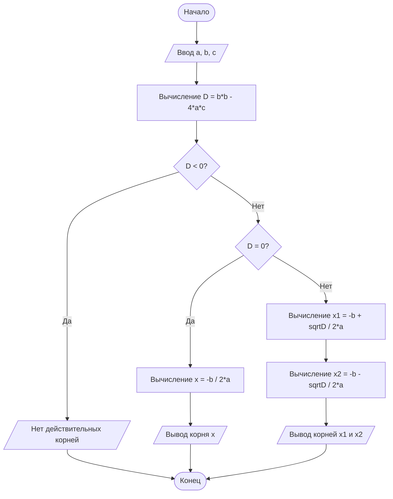



# Блок-схема алгоритма решения квадратного уравнения
## Краткое описание алгоритма
Данный алгоритм решает квадратное уравнение вида **ax² + bx + c = 0**:
1. Ввод коэффициентов `a`, `b`, `c`.
2. Вычисление дискриминанта по формуле `D = b² – 4ac`.
3. Проверка значения дискриминанта:
 - Если `D < 0` → действительных корней нет.
 - Если `D = 0` → один корень: `x = –b / (2a)`.
 - Если `D > 0` → два корня: 
 `x₁ = (–b + √D) / (2a)`, 
 `x₂ = (–b – √D) / (2a)`.
4. Вывод результата на экран.
5. Завершение работы.
## Диаграмма алгоритма (Mermaid)

